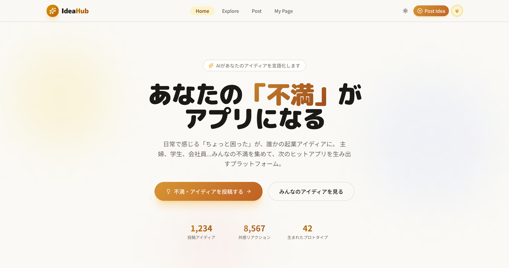
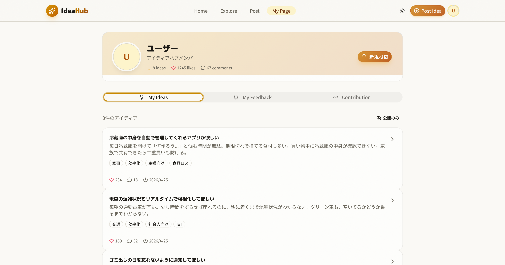

# Needia

**あなたの「不満」がアプリになる**

日常のちょっとした困りごとや「こうなったらいいな」を気軽に共有し、ハッカソン・起業・アプリ開発の種にするプラットフォームです。

🚀 **Live Demo:** [https://idea-hub-tau.vercel.app/](https://idea-hub-tau.vercel.app/)

---

## Screenshots

### Home



### My Page



---

## コンセプト

1. **集まる場所** — 解決そのものより、アイディアが集まるハブとしての価値
2. **Give & Take** — 他人のアイディアを見るには、自分も1つ投稿する「投稿ゲート」
3. **言語化支援** — AIチャットでぼやきをヒアリングし、アイディアの種に育てる
4. **つながる** — いいね・コメントで不満投稿者と実現者がマッチング

---

## 主な機能

- **ランディング** — サービスの価値訴求とトレンドアイディアの一部表示
- **AI投稿フロー** (`/post`) — チャット形式で不満・アイディアを具体化、タグ自動付与
- **アイディアフィード** (`/ideas`) — 共感順 / 新着順などで閲覧（投稿ゲート付き）
- **詳細・マッチング** (`/ideas/[id]`) — ヒアリング履歴、コメント、いいね、「作ってみた」リンク
- **マイページ** (`/profile`) — 自分のアイディアストック管理
- **ユーザーページ** (`/users/[id]`) — 他ユーザーの投稿一覧

---

## Tech Stack

| Category | Stack |
| --- | --- |
| Framework | [Next.js](https://nextjs.org/) (App Router) |
| UI | React, Tailwind CSS, shadcn/ui |
| Backend / Auth | [Supabase](https://supabase.com/) |
| Deploy | [Vercel](https://vercel.com/) |

---

## Getting Started

### 必要環境

- Node.js 20+
- npm / yarn / pnpm / bun
- Supabase プロジェクト（環境変数用）

### セットアップ

```bash
# 依存関係のインストール
npm install
```

プロジェクトルートに `.env.local` を作成し、以下を設定:

```env
NEXT_PUBLIC_SUPABASE_URL=your_supabase_url
NEXT_PUBLIC_SUPABASE_ANON_KEY=your_supabase_anon_key
```

```bash
# 開発サーバー起動
npm run dev
```

[http://localhost:3000](http://localhost:3000) を開いて確認してください。

### スクリプト

| Command | Description |
| --- | --- |
| `npm run dev` | 開発サーバー起動 |
| `npm run build` | 本番ビルド |
| `npm run start` | 本番サーバー起動 |
| `npm run lint` | ESLint |

---

## ページ構成

| Path | 説明 |
| --- | --- |
| `/` | ランディング |
| `/post` | AI支援付きアイディア投稿 |
| `/ideas` | フィード（投稿ゲートあり） |
| `/ideas/[id]` | 詳細・コメント・実装リンク |
| `/profile` | マイページ |
| `/users/[id]` | 他ユーザーのプロフィール |

---

## Deploy

本番は Vercel にデプロイ済みです。

→ [https://idea-hub-tau.vercel.app/](https://idea-hub-tau.vercel.app/)

---

## License

Private / Hackathon project
